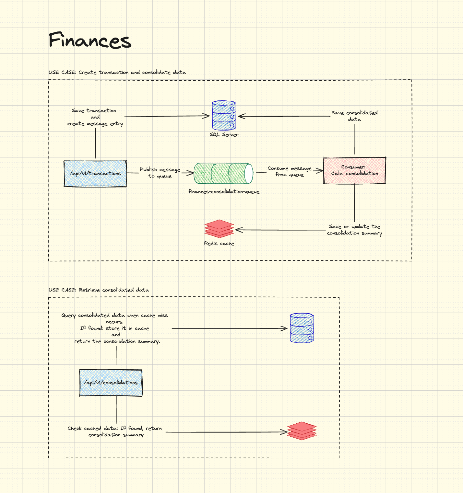

# **Finances - Arquitetura de Software**

## **1. Visão Geral**

Finances é um sistema projetado para gerenciar o fluxo de caixa de um comerciante, permitindo o registro de transações financeiras e a obtenção de dados consolidados diariamente. A arquitetura foi desenvolvida para garantir **escalabilidade, resiliência e segurança**, utilizando **padrões arquiteturais modernos** e boas práticas de desenvolvimento.

## **2. Componentes da Solução**

A solução é baseada em uma **arquitetura orientada a serviços**, separando claramente as responsabilidades dos componentes.

### **2.1. Endpoints Disponíveis**

A API fornece quatro endpoints principais:

1. **Cadastro de Usuário** (`POST /api/v1/users`)
   - Permite criar um novo usuário no sistema.
2. **Login de Usuário** (`POST /api/v1/users/login`)
   - Realiza a autenticação e retorna um token JWT.
3. **Lançamento de Transação** (`POST /api/v1/transactions`)
   - Registra uma transação de crédito ou débito para um usuário específico.
   - Cria um registro na tabela `transactions`.
   - Gera um evento na tabela `messages`.
   - Publica a mensagem na **fila de consolidação** para processamento assíncrono.
4. **Obtenção de Dados Consolidados** (`GET /api/v1/consolidations?date={date}`)
   - Busca os dados de consolidação financeira do usuário para um dia específico.
   - Primeiro consulta no **Redis**.
   - Se não encontrado, busca no **banco de dados** e salva no Redis para otimizar futuras requisições.

### **2.2. Banco de Dados**

A solução utiliza um **banco de dados relacional (SQL Server)** com as seguintes tabelas:

- **`users`**: Armazena informações dos usuários cadastrados.
- **`transactions`**: Guarda todas as transações (créditos e débitos) associadas a um usuário.
- **`messages`**: Registra eventos de novas transações a serem processadas pelo **serviço de consolidação**.
- **`consolidations`**: Armazena o saldo consolidado por usuário e data.

### **2.3. Fluxo Completo da Solução**

```plaintext
1. Usuário registra uma transação -> Salva na tabela transactions
2. Cria uma entrada na tabela messages
3. Envia a mensagem para a fila de consolidação (Redis)
4. O consumer processa a fila:
   4.1 Calcula saldo consolidado do usuário
   4.2 Salva na tabela consolidations
   4.3 Atualiza o Redis com os dados do dia
5. Usuário solicita os dados consolidados para um dia específico.
6. O sistema verifica no Redis:
   6.1 Se encontrado, retorna os dados imediatamente.
   6.2 Se não encontrado, busca no banco de dados.
7. Caso os dados sejam encontrados no banco de dados:
   7.1 Retorna para o usuário.
   7.2 Armazena no Redis para otimizar futuras requisições.
```

### **2.4. Cache (Redis)**

O Redis é utilizado para armazenar **dados consolidados** para otimizar consultas e reduzir a carga no banco de dados:

- **Ao consultar dados consolidados**, o sistema verifica primeiro no Redis.
- **Se não encontrado**, busca no banco de dados e salva no Redis para futuras requisições.
- **O Redis sempre reflete os dados do banco de dados**, garantindo consistência.

## **3. Arquitetura e Tecnologias Utilizadas**

| Componente              | Tecnologia Utilizada               |
| ----------------------- | ---------------------------------- |
| **Linguagem**           | C# (ASP.NET Core 8)                |
| **Banco de Dados**      | SQL Server                         |
| **Mensageria**          | Redis (como fila de processamento) |
| **Cache**               | Redis                              |
| **Autenticação**        | JWT (JSON Web Token)               |
| **Padrão Arquitetural** | Microsserviços                     |
| **Testes**              | xUnit + Moq                        |

## **4. Estratégias de Escalabilidade e Resiliência**

### **4.1. Escalabilidade**

- **Uso de mensageria**: O processamento assíncrono de transações desacopla o registro e a consolidação, melhorando a performance.
- **Cache com Redis**: Reduz consultas ao banco, acelerando as requisições.
- **Escalabilidade horizontal**: A API pode ser replicada em múltiplas instâncias para lidar com aumento de tráfego.

### **4.2. Resiliência**

- **Fila de processamento**: Evita que falhas temporárias impeçam o funcionamento do sistema.
- **Fallback ao banco de dados**: Caso o Redis esteja indisponível, o sistema busca os dados diretamente no banco.
- **Monitoramento e logs**: Uso de logging estruturado para rastrear operações e detectar falhas.

### **4.3. Estratégia de Escalonamento em Horários de Pico**

#### **Escalabilidade Horizontal**

- Adicionar mais instâncias da API para lidar com o aumento de carga.
- Configurar um balanceador de carga (como AWS ALB ou Azure Load Balancer) para distribuir requisições uniformemente.
- Implementar autoscaling com base em métricas como uso de CPU e número de requisições simultâneas.

#### **Otimização do Cache (Redis)**

- Configurar TTL (Time-to-Live) para liberar espaço automaticamente para dados menos usados.
- Utilizar particionamento (sharding) do Redis para distribuir a carga.
- Pré-carregar dados consolidados em horários prévios ao pico.

#### **Processamento Assíncrono**

- Aumentar o número de consumidores da fila durante picos.
- Implementar processamento em lote (batch processing) para reduzir operações de I/O no banco.
- Priorizar mensagens críticas na fila.

#### **Banco de Dados**

- Usar réplicas de leitura para diminuir a carga na instância principal.
- Otimizar índices e consultas para acelerar o acesso a dados frequentemente utilizados.
- Configurar particionamento de tabelas para distribuir dados e melhorar a performance.

#### **Monitoramento Proativo**

- Utilizar ferramentas como Prometheus e Grafana para monitorar métricas em tempo real.
- Configurar alertas automáticos para identificar gargalos antes que impactem o sistema.
- Rastrear logs distribuídos com ferramentas como Elastic APM ou OpenTelemetry.

#### **Rate Limiting e Throttling**

- Limitar o número de requisições por usuário/IP para evitar sobrecarga.
- Implementar políticas de throttling para controlar o tráfego durante picos.

#### **Planejamento de Capacidade**

- Realizar testes de carga regularmente para simular picos e ajustar configurações.
- Pré-aquecer recursos (pre-warming) antes de períodos conhecidos de alto tráfego.

### **4.4. Segurança**

- **Autenticação via JWT** para controle de acesso.
- **Criptografia de dados sensíveis** no banco.
- **Política de CORS** configurada para restringir acessos indevidos.

## **5. Execução Local**

### **Requisitos**

- Docker

### **Comandos para executar em modo produção**

- `cd src`
- `docker-compose up -d`
- Documentação Swagger: [http://localhost:5050/swagger/index.html](http://localhost:5050/swagger/index.html)
- Status da infraestrutura (SQL Server e Redis): [http://localhost:5050/health-details](http://localhost:5050/health-details)

### **Comandos para executar em modo debug (apenas Redis e SQL Server)**

- `cd src`
- `docker-compose -f docker-compose.debug.yml up -d`
- Execute o projeto no Visual Studio ou no VS Code.

### **Configuração do Banco de Dados**

Em ambos os cenários de execução (produção e debug), é necessário rodar o script SQL que cria a base de dados antes de iniciar a aplicação.

## **6. Desenho da arquitetura**


